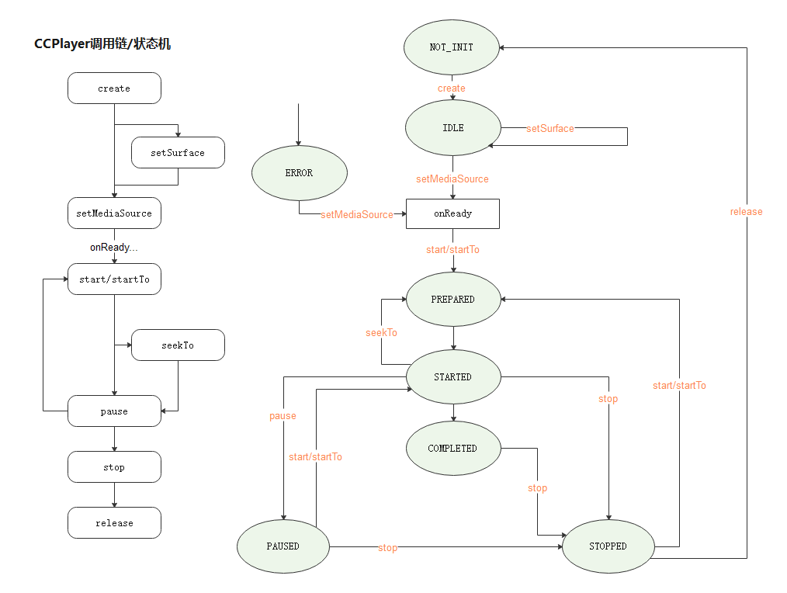

# ccplayer

## 简介

CcPlayer 是一个为 OpenHarmony 设计，支持音视频媒体的轻量级播放器应用框架，最低兼容至 OpenHarmony3.1。

- 支持音频/视频播放
- 视频播放组件，支持视频宽高比设置，手势控制音量、亮度、播放进度
- 支持自定义手势控制 UI
- OpenHarmony 3.1 和 3.2 自适应使用 AvPlayer 或 AudioPlayer 或 VideoPlayer

## 状态机



## 依赖方式

```ts
ohpm install @seagazer/ccplayer
```

## 注意事项

- 本库使用到系统接口（例如亮度控制），为了保证功能完整性，应用请使用系统签名（system_core 级别）。
- 如何修改签名等级可参考官方的应用 APL 等级说明：
  https://docs.openharmony.cn/pages/v4.0/zh-cn/application-dev/security/accesstoken-overview.md/

## 接口能力

- CcPlayer 媒体播放器
  |接口|参数|返回值|说明|
  |----|----|----|----|
  |create| PlayerType 媒体类型| CcPlayer| 创建播放器实例|
  |start| void| void| 开始/恢复播放|
  |startTo| position 起播时间戳 | void | 从指定时间戳开始播放|
  |pause | void| void| 暂停播放|
  |stop| void| void| 停止播放|
  |reset| void| void| 重置播放器|
  |release| void| void| 释放播放器|
  |seekTo| position 目标进度时间戳| void| 跳转至指定进度|
  |setMediaSource| mediaSource 媒体资源, onReaady? 设置资源成功回调 | void| 设置媒体资源|
  |getMediaSource| void| MediaSource| 获取当前播放的媒体资源|
  |setLooper| isLoop 是否循环播放| void| 设置循环播放|
  |setVolume| vol 音量大小| void| 设置音量|
  |isPlaying| void| boolean| 是否正在播放|
  |getDuration| void| number| 获取媒体资源的总时长|
  |getCurrentPosition| void| number| 获取当前播放时长|
  |getPlayerState| void| PlayerState| 获取当前播放状态|
  |getSystemPlayer| void| AVPlayer,VideoPlayer,AudioPlayer| 获取当前系统播放器实例|
  |setSurface| surfaceId 渲染表层 id| void| 绑定 surafce(仅媒体类型为视频时有效)|
  |addOnPreparedListener| listener: () => void| IPlayer| 添加媒体资源 prepare 状态监听|
  |removeOnPreparedListener| listener: () => void| IPlayer| 移除媒体资源 preapare 状态监听|
  |addOnCompletionListener| listener: () => void| IPlayer| 添加媒体资源播放结束状态监听|
  |removeOnCompletionListener| listener: () => void| IPlayer| 移除媒体资源播放结束状态监听|
  |addOnErrorListener| listener: (code: number, message: string) => void| IPlayer| 添加媒体资源播放异常状态监听|
  |removeOnErrorListener| listener: (code: number, message: string) => void| IPlayer| 移除媒体资源播放异常状态监听|
  |addOnProgressChangedListener| listener: (duration: number) => void| IPlayer| 添加播放进度状态监听|
  |removeOnProgressChangedListener| listener: (duration: number) => void| IPlayer| 移除播放进度状态监听|
  |addOnSeekChangedListener| listener: (duration: number) => void| IPlayer| 添加播放快进快退状态监听|
  |removeOnSeekChangedListener| listener: (duration: number) => void| IPlayer| 移除播放快进快退状态监听|
  |addOnVolumeChangedListener| listener: () => void| IPlayer| 添加媒体音量变化状态监听|
  |removeOnVolumeChangedListener| listener: () => void| IPlayer| 移除媒体音量变化状态监听|
  |addOnStateChangedListener| listener: (newState: PlayerState) => void| IPlayer| 添加播放状态变更监听|
  |removeOnStateChangedListener| listener: (newState: PlayerState) => void| IPlayer| 移除播放状态变更监听|
  |addOnVideoSizeChangedListener| listener: (newWidth, newHeight) => void| void| 添加视频尺寸变化监听|
  |removeOnVideoSizeChangedListener| listener: (newWidth, newHeight) => void| void| 移除视频尺寸变化监听|
  |addOnRenderFirstFrameListener| listener: () => void| void| 添加首帧画面渲染监听|
  |removeOnRenderFirstFrameListener| listener: () => void| void| 移除首帧画面渲染监听|

- CcPlayerView 视频播放组件
  | 属性 | 类型 | 说明 | 是否必填 |
  | ----------------------- | ------------------------------------------- | ------------------------ | -------- |
  | player | CcPlayer | 媒体播放器 | 是 |
  | viewSize | SizeOptions | 组件尺寸 | 是 |
  | asRatio | AspectRatio | 视频画面比例 | 是 |
  | autoHideControllerDelay | number | 自动隐藏手势 UI 的延时 | 否 |
  | isSupportGesture | boolean | 是否支持手势操作 | 否 |
  | onTouchCallback | (event: TouchEvent) => void | 触摸事件回调 | 否 |
  | onSurfaceDestroy | () => void | Surface 销毁事件回调 | 否 |
  | isDefaultGestureUI | boolean | 是否使用内置默认手势 UI | 否 |
  | gestureUIListener | (isVisible: boolean) => void | 手势 UI 显示/隐藏回调 | 否 |
  | gestureSeekAction | (seekPosition: number, max: number) => void | 手势 seek 进度回调 | 否 |
  | gestureBrightnessAction | (brightness: number, max: number) => void | 手势 Brightness 进度回调 | 否 |
  | gestureVolumeAction | (volume: number, max: number) => void | 手势 Volume 进度回调 | 否 |

- AspectRatio 视频画面比例
  | 属性 | 说明 |
  | ------- | ------------------------ |
  | AUTO | 自动匹配 |
  | W_16_9 | 16:9 宽屏 |
  | W_4_3 | 4:3 |
  | W_21_9 | 21:9 宽屏 |
  | STRETCH | 保持比例裁切填充 |
  | FILL | 拉伸填充 |

- PlayerState 播放器状态
  | 属性 | 说明 |
  | --------------- | ---------------------- |
  | STATE_NOT_INIT | 初始状态(未实例化) |
  | STATE_IDLE | 播放器实例化且闲置状态 |
  | STATE_PREPARED | 播放器加载资源完成状态 |
  | STATE_STARTED | 播放器正在播放状态 |
  | STATE_PAUSED | 播放器暂停状态 |
  | STATE_STOPPED | 播放器停止状态 |
  | STATE_COMPLETED | 播放器播放结束状态 |
  | STATE_ERROR | 播放器播放异常状态 |

- PlayerType 媒体播放器类型
  | 属性 | 说明 |
  | ----- | ---------- |
  | AUDIO | 音频播放器 |
  | VIDEO | 视频播放器 |

- MediaSourceFactory 媒体资源构建器
  | 接口 | 参数 | 返回值 | 说明 |
  | ------------ | --------------------------------------------------------------- | -------------------- | ------------------------- |
  | createFile | filePath 文件绝对路径, title? 媒体标题 | Promise\<MediaSource> | 通过本地文件创建媒体资源 |
  | createAssets | abilityContext 上下文, assetsPath 资源相对路径, title? 媒体标题 | Promise\<MediaSource> | 通过 Raw 文件创建媒体资源 |
  | createUrl | url 媒体链接地址, title? 媒体标题 | MediaSource | 通过 url 地址创建媒体资源 |

## 场景示例

- 使用 CcPlayerView 播放视频的方式：

```ts
@Entry
@Component
struct PlayerViewPage {
    // 视频画面比例模式
    @State videoRatio: number = AspectRatio.AUTO
    private player: CcPlayer | null = null

    aboutToAppear() {
        // 1.实例化CcPlayer
        this.player = CcPlayer.create(PlayerType.VIDEO)
    }

    build() {
        Column() {
            Stack() {
                // 2.引用CcPlayerView视频播放组件，设置参数，绑定CcPlayer
                CcPlayerView({
                    player: this.player,
                    viewSize: {width: "100%", height: "100%"},
                    asRatio: $videoRatio
                })
            }
            .width(400)
            .height(300)
            .clip(true)

            // play actions
            Button("play")
                .onClick(() => {
                    this.play()
                })
        }
        .width("100%")
        .height("100%")
        .justifyContent(FlexAlign.Center)
    }

    private async play() {
        // 3.创建mediaSource
        let src = await MediaSourceFactory.createFile(getContext(this).filesDir + "/test.mp4", "test.mp4")
        // 4.设置mediaSource
        this.player!.setMediaSource(src, () => {
            // 5.设置成功回调，开始播放
            this.player!.start()
        })
    }

    aboutToDisappear() {
        // 6.释放资源
        this.player!.release()
    }
}
```

- 使用 CcPlayer 播放视频的方式：

```ts
@Entry
@Component
struct PlayerViewPage {
    private controller = new XComponentController()
    private player: CcPlayer | null = null

    aboutToAppear() {
        // 1.实例化CcPlayer
        this.player = CcPlayer.create(PlayerType.VIDEO)
    }

    build() {
        Column() {
            // render surface
            XComponent({
                type: "surface",
                id: "video",
                controller: this.controller
            }).onLoad(() => {
                let surfaceId = this.controller.getXComponentSurfaceId()
                // 2.设置surface，播放前必须设置
                this.player!.setSurface(surfaceId)
            })
            .width(400)
            .height(300)

            // play actions
            Button("play")
                .onClick(() => {
                    this.play()
                })
        }
        .width("100%")
        .height("100%")
        .justifyContent(FlexAlign.Center)
    }

    private async play() {
        // 3.创建mediaSource
        let src = await MediaSourceFactory.createFile(getContext(this).filesDir + "/test.mp4", "test.mp4")
        // 4.设置mediaSource
        this.player!.setMediaSource(src, () => {
            // 5.设置成功回调，开始播放
            this.player!.start()
        })
    }

    aboutToDisappear() {
        // 6.释放资源
        this.player!.release()
    }
}
```

- 使用 CcPlayer 播放音乐的方式：

```ts
@Entry
@Component
struct PlayerViewPage {
    private player: CcPlayer | null = null

    aboutToAppear() {
        // 1.实例化CcPlayer
        this.player = CcPlayer.create(PlayerType.AUDIO)
    }

    build() {
        Column() {
            // play actions
            Button("play")
                .onClick(() => {
                    this.play()
                })
        }
        .width("100%")
        .height("100%")
        .justifyContent(FlexAlign.Center)
    }

    private async play() {
        // 2.创建mediaSource
        let src = await MediaSourceFactory.createFile(getContext(this).filesDir + "/test.mp3", "test.mp3")
        // 3.设置mediaSource
        this.player!.setMediaSource(src, () => {
            // 4.设置成功回调，开始播放
            this.player!.start()
        })
    }

    aboutToDisappear() {
        // 5.释放资源
        this.player!.release()
    }
}
```

更多使用场景和示例，例如自定义手势操作 UI，播放器状态事件监听等，可以参考本库代码仓的 entry 工程：
https://github.com/seagazer/ccplayer
