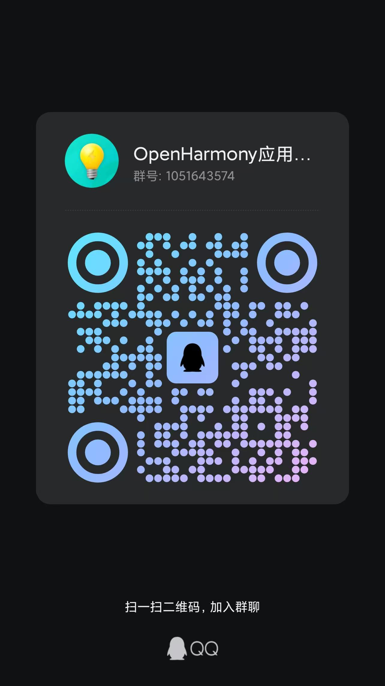

# ccplayer

## 简介

CcPlayer 是一个为 OpenHarmony和HarmonyOS Next 设计，支持音视频媒体的轻量级播放器应用框架。

- 支持音频/视频播放
- 支持绑定播控中心(**HarmonyOS**)
- 支持长时后台播放
- 支持画中画悬浮窗播放(**HarmonyOS**)
- 支持音频焦点监听及默认处理策略
- 提供视频播放组件CcPlayerView，支持视频宽高比切换及手势操作
- 提供视频播放组件CcPlayerViewV2，支持状态管理框架V2版本
- 提供默认手势控制面板组件CcGestureOverlay
- 提供默认媒体控制面板组件CcControllerOverlay
- 提供默认标题面板组件CcTitleBarOverlay
- 提供默认加载面板组件CcLoadingOverlay
- 提供播放器实例缓存池，提供资源管理及复用能力
- 支持获取本地视频文件缩略图
- 支持接入自定义播放业务(切换播放内核，自定义类需要实现IPlayer接口)
- TODO:新增适配IjkPlayer内核（Doing...）

## 示例效果
| 视频组件                                                                          | 音乐播放                                                                          | 播控中心                                                                          | PIP模式                                                                           |
| --------------------------------------------------------------------------------- | --------------------------------------------------------------------------------- | --------------------------------------------------------------------------------- | --------------------------------------------------------------------------------- |
|  |  |  |  |

## 依赖方式

```shell
ohpm install @seagazer/ccplayer
```

## 注意事项

- 从1.0.6版本开始基于API 12进行重构，仅支持OpenHarmony-5.0+ Release和HarmonyOS 5.0.0+。
- 如果需要在5.0-Release之前的系统版本中使用，请采用1.0.5及以下版本。各个版本详情可以参照之前版本的ChangeLog说明。
- 因为OpenHarmony缺失部分能力，某些能力仅支持HarmonyOS，上述简介中已标注。


## 接口能力

- CcPlayer 媒体播放器  
  | 接口                                  | 参数                                                                                | 返回值                  | 说明                                                          |
  | ------------------------------------- | ----------------------------------------------------------------------------------- | ----------------------- | ------------------------------------------------------------- |
  | construct                             | context: BaseContxt                                                                 | CcPlayer                | 创建CcPlayer实例                                              |
  | setPlayer                             | player: IPlayer                                                                     | void                    | 设置播放器实例，用户可通过实现IPlayer接口来自定义播放业务实现 |
  | start                                 | void                                                                                | void                    | 开始/恢复播放                                                 |
  | startTo                               | position: number                                                                    | void                    | 从指定时间戳开始播放                                          |
  | pause                                 | void                                                                                | void                    | 暂停播放                                                      |
  | stop                                  | void                                                                                | void                    | 停止播放                                                      |
  | reset                                 | void                                                                                | void                    | 重置播放器                                                    |
  | release                               | void                                                                                | void                    | 释放播放器                                                    |
  | seekTo                                | position: number                                                                    | void                    | 跳转至指定进度                                                |
  | setSeekMode                           | mode: media.SeekMode                                                                | void                    | 设置seek模式，默认SEEK_CLOSEST                                |
  | setMediaSource                        | mediaSource: MediaSource , onReady?: ()=>void                                       | void                    | 设置媒体资源，在onReady回调中可以调用start开启播放            |
  | getMediaSource                        | void                                                                                | MediaSource             | 获取当前播放的媒体资源                                        |
  | setLooper                             | isLoop: boolean                                                                     | void                    | 设置循环播放                                                  |
  | setVolume                             | vol: number                                                                         | void                    | 设置音量                                                      |
  | setPlaySpeed                          | speed: number \| media.PlaybackSpeed                                                | void                    | 设置播放倍速                                                  |
  | isPlaying                             | void                                                                                | boolean                 | 是否正在播放                                                  |
  | getDuration                           | void                                                                                | number                  | 获取媒体资源的总时长                                          |
  | getCurrentPosition                    | void                                                                                | number                  | 获取当前播放时长                                              |
  | getPlayerState                        | void                                                                                | PlayerState             | 获取当前播放状态                                              |
  | getSystemPlayer                       | void                                                                                | AVPlayer \| IPlayer     | 获取当前系统播放器实例                                        |
  | setSurface                            | surfaceId: string                                                                   | void                    | 绑定 surafce(仅媒体类型为视频时有效)                          |
  | addOnPreparedListener                 | listener: () => void                                                                | IPlayer                 | 添加媒体资源 prepare 状态监听                                 |
  | removeOnPreparedListener              | listener: () => void                                                                | IPlayer                 | 移除媒体资源 preapare 状态监听                                |
  | addOnCompletionListener               | listener: () => void                                                                | IPlayer                 | 添加媒体资源播放结束状态监听                                  |
  | removeOnCompletionListener            | listener: () => void                                                                | IPlayer                 | 移除媒体资源播放结束状态监听                                  |
  | addOnErrorListener                    | listener: (code: number, message: string) => void                                   | IPlayer                 | 添加媒体资源播放异常状态监听                                  |
  | removeOnErrorListener                 | listener: (code: number, message: string) => void                                   | IPlayer                 | 移除媒体资源播放异常状态监听                                  |
  | addOnProgressChangedListener          | listener: (duration: number) => void                                                | IPlayer                 | 添加播放进度状态监听                                          |
  | removeOnProgressChangedListener       | listener: (duration: number) => void                                                | IPlayer                 | 移除播放进度状态监听                                          |
  | addOnSeekChangedListener              | listener: (duration: number) => void                                                | IPlayer                 | 添加播放快进快退状态监听                                      |
  | removeOnSeekChangedListener           | listener: (duration: number) => void                                                | IPlayer                 | 移除播放快进快退状态监听                                      |
  | addOnVolumeChangedListener            | listener: (volume: number) => void                                                  | IPlayer                 | 添加媒体音量变化状态监听                                      |
  | removeOnVolumeChangedListener         | listener: (volume: number) => void                                                  | IPlayer                 | 移除媒体音量变化状态监听                                      |
  | addOnStateChangedListener             | listener: (state: PlayerState) => void                                              | IPlayer                 | 添加播放状态变更监听                                          |
  | removeOnStateChangedListener          | listener: (state: PlayerState) => void                                              | IPlayer                 | 移除播放状态变更监听                                          |
  | addOnVideoSizeChangedListener         | listener: (width: number, height: number) => void                                   | IPlayer                 | 添加视频尺寸变化监听                                          |
  | removeOnVideoSizeChangedListener      | listener: (width: number, height: number) => void                                   | IPlayer                 | 移除视频尺寸变化监听                                          |
  | addOnRenderFirstFrameListener         | listener: () => void                                                                | IPlayer                 | 添加首帧画面渲染监听                                          |
  | removeOnRenderFirstFrameListener      | listener: () => void                                                                | IPlayer                 | 移除首帧画面渲染监听                                          |
  | addOnAudioFocusChangedListener        | (event: AudioFocusEvent) => void                                                    | IPlayer                 | 添加音频焦点变化监听                                          |
  | removeOnAudioFocusChangedListener     | (event: AudioFocusEvent) => void                                                    | IPlayer                 | 移除音频焦点变化监听                                          |
  | addOnMediaChangedListener             | (source: MediaSource) => void                                                       | void                    | 添加切换媒体资源监听                                          |
  | removeOnMediaChangedListener          | (source: MediaSource) => void                                                       | void                    | 移除切换媒体资源监听                                          |
  | bindAvSession                         | context:BaseContext, sessioName:string, type:AVSessionType, agentInfo:WantAgentInfo | void                    | 绑定播控中心                                                  |
  | addAvSessionCallback                  | callback: AvSessionCallback                                                         | void                    | 添加播控中心操作事件监听                                      |
  | removeAvSessionCallback               | callback: AvSessionCallback                                                         | void                    | 移除播控中心操作事件监听                                      |
  | setBackgroundPlayEnable               | backgroundPlay: boolean                                                             | Promise\<boolean>       | 设置是否开启后台长时播放                                      |
  | setXComponentController               | controller: XComponentController                                                    | void                    | 设置xComponent的controller，pip必须设置                       |
  | getXComponentController               | void                                                                                | XComponentController    | 返回xComponent的controller                                    |
  | enablePip                             | navigationId: string, pipType: PiPWindow.PiPTemplateType                            | PiPWindow.PiPController | 启用pip画中画能力                                             |
  | disablePip                            | void                                                                                | void                    | 禁用pip画中画能力                                             |
  | startPip                              | void                                                                                | void                    | 开启pip画中画                                                 |
  | stopPip                               | void                                                                                | void                    | 关闭pip画中画                                                 |
  | addOnPipStateChangedListener          | listener: (state: PiPWindow.PiPState, reason: string) => void                       | void                    | 添加pip状态监听                                               |
  | removeOnPipStateChangedListener       | listener: (state: PiPWindow.PiPState, reason: string) => void                       | void                    | 移除pip状态监听                                               |
  | getSnapshotFromFile                   | filePath: string, width: number, height: number, timestamp: number                  | Promise\<PixelMap>      | 获取视频文件缩略图                                            |
  | getSnapshotFromAssets                 | rawPath: string, width: number, height: number, timestamp: number                   | Promise\<PixelMap>      | 获取视频文件缩略图                                            |
  | setKeepScreenOn                       | uiContext: UIContext, keepScreenOn: boolean                                         | Promise\<boolean>       | 设置屏幕是否常亮                                              |
  | addOnBufferProgressChangedListener    | listener: (duration: number) => void                                                | void                    | 添加缓冲进度监听                                              |
  | removeOnBufferProgressChangedListener | listener: (duration: number) => void                                                | void                    | 移除缓冲进度监听                                              |
  | getBufferPosition                     | void                                                                                | number                  | 获取当前缓冲进度                                              |

- MediaSourceFactory 媒体资源构建器  
  | 接口         | 参数                                                                                                                     | 返回值                | 说明                          |
  | ------------ | ------------------------------------------------------------------------------------------------------------------------ | --------------------- | ----------------------------- |
  | createFile   | title: string, filePath: string, cover?: string\|Pixelmap                                                                | Promise\<MediaSource> | 通过本地文件创建媒体资源      |
  | createAssets | title: string, rawAssetsPath: string, cover?: string\|PixelMap                                                           | MediaSource           | 通过 Raw 文件创建媒体资源     |
  | createUrl    | title: string, url: string, cover?: string\|Pixelmap, header?: Record<string, string>, strategy?: media.PlaybackStrategy | MediaSource           | 通过网络 url 地址创建媒体资源 |

- MediaLogger 调试信息开关  
  | 接口        | 参数           | 返回值 | 说明                                |
  | ----------- | -------------- | ------ | ----------------------------------- |
  | setDebugger | debug: boolean | void   | 设置是否开始调试信息打印，默认false |

- CcPlayerPool 播放器实例缓存池(用于同页面多视频需要频繁切换的播放场景，实现预加载能力)  
  | 接口        | 参数                                | 返回值       | 说明                                        |
  | ----------- | ----------------------------------- | ------------ | ------------------------------------------- |
  | getInstance | void                                | CcPlayerPool | 获取CcPlayerPool实例(单例)                  |
  | init        | context: Context, cacheSize: number | void         | 设置播放器实例缓存池大小                    |
  | get         | void                                | CcPlayer     | 从缓存池获取一个可用的播放器实例            |
  | recycle     | player: CcPlayer                    | void         | 回收从缓存池中获取且使用过的播放器实例      |
  | destroy     | void                                | void         | 清空缓存池中播放器实例,并且重置CcPlayerPool |


- CcPlayerView 视频播放组件 / CcPlayerViewV2(适用于状态管理框架V2版本) 
  | 属性                               | 类型                                                             | 说明                                                            | 是否必填 |
  | ---------------------------------- | ---------------------------------------------------------------- | --------------------------------------------------------------- | -------- |
  | player                             | CcPlayer                                                         | 媒体播放器                                                      | 是       |
  | gestureAreaConfig                  | GestureAreaConfig                                                | 手势区域配置，默认左半边亮度，右半边音量                        | 否       |
  | horizontalGestureDamping           | number                                                           | 手势水平滑动阻尼系数，默认2，手势滑动距离与进度换算比为2：1     | 否       |
  | verticalGestureDamping             | number                                                           | 手势垂直滑动阻尼系数，默认1.5，手势滑动距离与进度换算比为1.5：1 | 否       |
  | renderType                         | XComponentType                                                   | 视频渲染模式，默认SURFACE                                       | 否       |
  | asRatio                            | AspectRatio                                                      | 视频画面比例                                                    | 是       |
  | autoHideControllerDelay            | number                                                           | 自动隐藏手势 UI 的延时，默认1.5s                                | 否       |
  | isSupportGesture                   | boolean                                                          | 是否支持手势操作，默认true                                      | 否       |
  | onTouchCallback                    | (event: TouchEvent) => void                                      | 触摸事件回调                                                    | 否       |
  | onSurfaceCreated                   | (surfaceId: string) => void                                      | Surface 创建事件回调                                            | 否       |
  | onSurfaceDestroy                   | (surfaceId: string) => void                                      | Surface 销毁事件回调                                            | 否       |
  | onGestureUIListener                | (visible: boolean) => void                                       | 手势 UI 显示/隐藏回调                                           | 否       |
  | onGestureAction                    | (type: GestureType, percent: number, isTouchUp: boolean) => void | 手势操作回调                                                    | 否       |
  | aspectRatioChangeAnimationDuration | number                                                           | 视频切换宽高比动效时长，默认150ms                               | 否       |
  | defaultBrightness                  | number                                                           | 组件启用的默认手势亮度值，取值0-1，默认0.5                      | 否       |
  | defaultVolume                      | number                                                           | 组件启用的默认手势音量值，取值0-1，默认1                        | 否       |


- CcGestureOverlay 手势控制UI面板，需要结合NodeContainer使用，实时的UI状态值可以通过CcPlayerView的onGestureAction和onGestureUIListener回调中获取  
  | 接口                | 参数                                                                         | 返回值           | 说明                                  |
  | ------------------- | ---------------------------------------------------------------------------- | ---------------- | ------------------------------------- |
  | construct           | player: CcPlayer                                                             | CcGestureOverlay | 创建CcGestureOverlay实例              |
  | setTextSize         | size: number                                                                 | void             | 设置overlay字体大小，单位fp，默认14fp |
  | setTextColor        | color: ResourceColor                                                         | void             | 设置overlay字体颜色，默认#ffffffff    |
  | setBackgroundColor  | type: GestureType                                                            | void             | 设置overlay背景颜色，默认#a6000000    |
  | setGestureType      | size: number                                                                 | void             | 设置当前CcPlayerView的手势类型        |
  | setGesturePercent   | percent: number                                                              | void             | 设置当前CcPlayerView的手势进度值      |
  | handleGestureAction | uiContext: UIContext, type: GestureType, percent: number, isTouchUp: boolean | void             | 手势默认处理                          |
  | setVisible          | visible: boolean                                                             | void             | 设置当前Overlay的显示状态             |

- CcControllerOverlay 媒体播放控制UI面板
  | 接口                   | 参数                       | 返回值           | 说明                                                        |
  | ---------------------- | -------------------------- | ---------------- | ----------------------------------------------------------- |
  | construct              | player: CcPlayer           | CcGestureOverlay | 创建CcControllerOverlay实例                                 |
  | setTextSize            | size: Length               | void             | 设置进度值字体大小，单位fp，默认14fp                        |
  | setTextColor           | color: ResourceColor       | void             | 设置进度值字体颜色，默认#ffffffff                           |
  | setSliderTrackColor    | color: ResourceColor       | void             | 设置进度条轨道颜色，默认#ccffffff                           |
  | setSliderBlockColor    | color: ResourceColor       | void             | 设置进度条滑块颜色，默认#ffffffff                           |
  | setSliderSelectedColor | color: ResourceColor       | void             | 设置进度条的进度颜色，默认sys.color.ohos_id_color_emphasize |
  | setPadding             | padding: Lenght \| Padding | void             | 设置overlay字体与左右边缘的水平边距                         |
  | setSliderMargin        | margin: Margin             | void             | 设置seekbar与文本的水平间距                                 |
  | setVisible             | visible: boolean           | void             | 设置当前Overlay的显示状态                                   |

- CcTitleBarOverlay 媒体标题UI面板
  | 接口               | 参数                       | 返回值           | 说明                                   |
  | ------------------ | -------------------------- | ---------------- | -------------------------------------- |
  | construct          | player: CcPlayer           | CcGestureOverlay | 创建CcTitleBarOverlay实例              |
  | setTextSize        | size: Length               | void             | 设置标题字体大小，单位fp，默认14fp     |
  | setTextColor       | color: ResourceColor       | void             | 设置标题字体颜色，默认#ffffffff        |
  | setBackgroundColor | type: GestureType          | void             | 设置overlay背景颜色，默认#a6000000     |
  | setPadding         | padding: Length \| Padding | void             | 设置当前CcPlayerView的标题组件的内边距 |
  | setVisible         | visible: boolean           | void             | 设置当前Overlay的显示状态              |

- CcLoadingOverlay 视频加载UI面板  
  | 接口               | 参数                       | 返回值           | 说明                                      |
  | ------------------ | -------------------------- | ---------------- | ----------------------------------------- |
  | construct          | player: CcPlayer           | CcGestureOverlay | 创建CcLoadingOverlay实例                  |
  | setLoadingText     | text: string               | void             | 设置loading提示文本                       |
  | setLoadingSize     | size: Length               | void             | 设置loading的大小，单位vp，默认56vp       |
  | setLoadingMargin   | margin: Length             | void             | 设置loading和文本的间距，单位vp，默认16vp |
  | setPadding         | padding: Lenght \| Padding | void             | 设置loading组件四周边距                   |
  | setTextSize        | size: Length               | void             | 设置loading字体大小，单位fp，默认14fp     |
  | setTextColor       | color: ResourceColor       | void             | 设置loading字体颜色，默认#ffffffff        |
  | setBackgroundColor | type: GestureType          | void             | 设置overlay背景颜色，默认#a6000000        |
  | setVisible         | visible: boolean           | void             | 设置当前Overlay的显示状态                 |


- GestureType 视频播放组件手势类型  
  | 枚举值     | 说明     |
  | ---------- | -------- |
  | BRIGHTNESS | 亮度调节 |
  | PROGRESS   | 进度调节 |
  | VOLUME     | 音量调节 |

- GestureAreaConfig 视频播放组件手势区域配置  
  | 属性  | 类型        | 说明                         | 是否必填 |
  | ----- | ----------- | ---------------------------- | -------- |
  | left  | GestureType | 左半边区域手势类型，默认亮度 | 否       |
  | right | GestureType | 右半边区域手势类型，默认音量 | 否       |

- AspectRatio 视频画面比例  
  | 枚举值  | 说明             |
  | ------- | ---------------- |
  | AUTO    | 自动匹配         |
  | W_16_9  | 16:9 宽屏        |
  | W_4_3   | 4:3              |
  | W_21_9  | 21:9 宽屏        |
  | STRETCH | 保持比例裁切填充 |
  | FILL    | 拉伸填充         |

- AudioFocusEvent 音频焦点变更事件  
  | 枚举值           | 说明         |
  | ---------------- | ------------ |
  | AUDIO_FOCUS_LOST | 音频焦点丢失 |
  | AUDIO_FOCUS_GAIN | 音频焦点获取 |

- AvSessionCallback 播控中心事件回调  
  | 属性       | 类型       | 说明       |
  | ---------- | ---------- | ---------- |
  | onNext     | () => void | 播放下一首 |
  | onPrevious | () => void | 播放上一首 |

- PlayerState 播放器状态  
  | 枚举值          | 说明                   |
  | --------------- | ---------------------- |
  | STATE_NOT_INIT  | 初始状态(未实例化)     |
  | STATE_IDLE      | 播放器实例化且闲置状态 |
  | STATE_PREPARED  | 播放器加载资源完成状态 |
  | STATE_STARTED   | 播放器正在播放状态     |
  | STATE_PAUSED    | 播放器暂停状态         |
  | STATE_STOPPED   | 播放器停止状态         |
  | STATE_COMPLETED | 播放器播放结束状态     |
  | STATE_ERROR     | 播放器播放异常状态     |


## 场景示例

- 使用 CcPlayerView 播放视频，以及快速集成默认手势和加载Overlay的方式(V2版本使用流程一致)：

```typescript
@Entry
@Component
struct PlayerViewPage {
    // 视频画面比例模式
    @State videoRatio: AspectRatio = AspectRatio.AUTO
     // 1.实例化CcPlayer
    private player: CcPlayer = new CcPlayer(getContext(this))
    // 2.实例化手势UI面板
    private gestureOverlay: CcGestureOverlay = new CcGestureOverlay(this.player)

    aboutToAppear(): void {
        // 3.设置手势UI面板各项参数
        this.gestureOverlay.setTextSize(18)
        this.gestureOverlay.setTextColor('#ffead981')
    }

    private handleGestureAction() {
        // ...用户自己手动处理手势事件
    }

    build() {
        Column() {
            // 注意：Overlay面板采用层叠的组合方式，需要使用Stack或者RelativeContainer作为根容器
            Stack() {
                // 4.引用CcPlayerView视频播放组件，设置参数，绑定CcPlayer
                CcPlayerView({
                    player: this.player,
                    asRatio: this.videoRatio,
                    // onGestureAction: (type: GestureType, percent: number, isTouchUp: boolean) => {
                    //     // 方式1：用户自己手动处理手势事件
                    //     this.gestureOverlay.setGestureType(type) //刷新UI
                    //     this.gestureOverlay.setGesturePercent(percent) //刷新UI
                    //     this.handleGestureAction() //处理事件
                    // },
                    // onGestureUIListener: (visible: boolean) => {
                    //     // 方式1：刷新手势UI面板参数
                    //     this.gestureOverlay.setVisible(visible)
                    // },      
                    // 方式2：推荐，不使用方式1组件内部即自动管理所有状态              
                })
                // 5.使用NodeContainer结合CcGestureOverlay默认手势面板
                NodeContainer(this.gestureOverlay)            
                // 6.参照上面的手势Overlay使用其他Overlay进行组合  
            }
            .width(400)
            .height(300)
            .clip(true)

            // play actions
            Button("play")
                .onClick(() => {
                    this.play()
                })
        }
        .width("100%")
        .height("100%")
        .justifyContent(FlexAlign.Center)
    }

    private async play() {
        // 7.创建mediaSource
        let src = await MediaSourceFactory.createFile(getContext(this).filesDir + "/test.mp4", "test.mp4")
        // 8.设置mediaSource
        this.player!.setMediaSource(src, () => {
            // 9.设置成功回调，开始播放
            this.player.start()
        })
    }

    aboutToDisappear() {
        // 10.释放资源
        this.player.release()
    }
}
```

- 使用 CcPlayer 播放视频的方式：

```typescript
@Entry
@Component
struct PlayerViewPage {
    private controller = new XComponentController()
    // 1.实例化CcPlayer
    private player = new CcPlayer(getContext(this))

    build() {
        Column() {
            // render surface
            XComponent({
                type: "surface",
                id: "video",
                controller: this.controller
            }).onLoad(() => {
                let surfaceId = this.controller.getXComponentSurfaceId()
                // 2.设置surface，播放前必须设置
                this.player.setSurface(surfaceId)
            })
            .width(400)
            .height(300)

            // play actions
            Button("play")
                .onClick(() => {
                    this.play()
                })
        }
        .width("100%")
        .height("100%")
        .justifyContent(FlexAlign.Center)
    }

    private async play() {
        // 3.创建mediaSource
        let src = await MediaSourceFactory.createFile(getContext(this).filesDir + "/test.mp4", "test.mp4")
        // 4.设置mediaSource
        this.player.setMediaSource(src, () => {
            // 5.设置成功回调，开始播放
            this.player.start()
        })
    }

    aboutToDisappear() {
        // 6.释放资源
        this.player.release()
    }
}
```

- 使用 CcPlayer 播放音乐的方式：

```typescript
@Entry
@Component
struct PlayerViewPage {
     // 1.实例化CcPlayer
    private player = new CcPlayer(getContext(this))

    build() {
        Column() {
            // play actions
            Button("play")
                .onClick(() => {
                    this.play()
                })
        }
        .width("100%")
        .height("100%")
        .justifyContent(FlexAlign.Center)
    }

    private async play() {
        // 2.创建mediaSource
        let src = await MediaSourceFactory.createFile(getContext(this).filesDir + "/test.mp3", "test.mp3")
        // 3.设置mediaSource
        this.player.setMediaSource(src, () => {
            // 4.设置成功回调，开始播放
            this.player!.start()
        })
    }

    aboutToDisappear() {
        // 5.释放资源
        this.player.release()
    }
}
```

- 使用 CcPlayerView 结合 CcPlayerPool 进行页面上下滑动切换播放(预加载快速启播)：

```typescript
// 主页面
@Component
export struct PagePlayerSample {
    private dataList = new DataProvider() //懒加载数据源
    @State curIndex: number = 0
    private playerPool: CcPlayerPool = CcPlayerPool.getInstance()    

    aboutToAppear(): void {
        // 初始化缓存池
        this.playerPool.init(getContext(this), 4)        
        // 添加mock数据
        this.dataList.uriList.push('video1.mp4')
        this.dataList.uriList.push('video2.mp4')
        this.dataList.uriList.push('video3.mp4')
        this.dataList.uriList.push('video4.mp4')
        this.dataList.uriList.push('video5.mp4')
    }

    aboutToDisappear(): void {
        // 销毁缓存池 
        this.playerPool.destroy()
    }    

    build() {
        NavDestination() {
            Swiper() {
                LazyForEach(this.dataList, (uri: string, index: number) => {
                    VideoItemPageView({
                        uri: uri,
                        pageIndex: index,
                        curPageIndex: this.curIndex
                    })
                })
            }
            .width('100%')
            .height('100%')
            .vertical(true) //设置垂直滑动
            .loop(true) //设置可循环滑动
            .cachedCount(1) //设置缓存量
            .duration(300)
            .onAnimationStart((_, targetIndex) => { //刷新当前滑动结束的页面索引
                this.curIndex = targetIndex
            })
        }
        .width('100%')
        .height('100%')
        .title("PagePlayerSample")        
    }
}
```

```typescript
// 单个子页面
@Component
struct VideoItemPageView {
    // 每个page页面从缓存池中获取播放器实例，进行视频播放
    private player = CcPlayerPool.getInstance().get()
    pageIndex: number = 0 //自身索引
    uri: string = "" //媒体资源uri
    @Watch('onPageChanged') @Prop curPageIndex: number = 0 // 父组件传递过来，当前页面索引
    @State ratio: AspectRatio = AspectRatio.AUTO

    onPageChanged() {
        if (this.curPageIndex == this.pageIndex) { //索引变化，如果当前页面显示，直接开启播放
            this.player.start()
        } else {
            if (this.player.isPlaying()) { //索引变化，如果当前页面隐藏且正在播放，直接暂停播放
                this.player.pause()
            }
        }
    }


    aboutToDisappear(): void {
        // 通知缓存池进行播放器实例回收
        CcPlayerPool.getInstance().recycle(this.player)
    }

    build() {
        Stack() {
            CcPlayerView({
                player: this.player,
                asRatio: this.ratio,
                renderType: XComponentType.SURFACE,
                isSupportGesture: false,
                onSurfaceCreated: () => { //在该回调中，提前预加载资源
                    let src = MediaSourceFactory.createAssets('', this.uri)
                    this.player.setMediaSource(src, () => {
                        if (this.curPageIndex == this.pageIndex) { //如果当前页面显示，则开启播放，否则仅预加载资源
                            this.player.start()
                        }
                    })
                }
            }).width('100%')
                .height('100%')
        }
        .width('100%')
        .height('100%')
    }
}
```

- 使用 CcPlayer 获取本地文件缩略图，仅支持视频文件，部分编码格式的视频文件可能获取失败：(注意：该方法不支持在开始播放流程之后调用(包括MediaSourceFactory创建资源)，因为获取缩略图会操作媒体文件，播放过程不允许和播放器同时操作同一个文件)

```typescript
@Entry
@Component
struct PlayerViewPage {
    @State snapshot?: PixelMap = undefined
     // 1.实例化CcPlayer
    private player = new CcPlayer(getContext(this))

    build() {
        Column() {
            Image(this.snapshot ? this.snapshot : $r('app.media.app_icon'))
                .objectFit(ImageFit.Cover)
                .width(200)
                .height(150)
            Button("getSnapshot")
                .onClick(() => {
                    // 注意：该方法不支持在开始播放流程之后调用，因为获取缩略图会操作媒体文件，播放过程不允许和播放器同时操作同一个文件
                    // 2.从raw文件获取缩略图
                    this.player.getSnapshotFromAssets('video1.mp4', 200, 150, 1500)
                                .then((result: PixelMap) => {
                                    this.snapshot = result
                                })
                    // 从file文件获取调用该接口：getSnapshotFromFile
                })
        }
        .width("100%")
        .height("100%")
        .justifyContent(FlexAlign.Center)
    }
}
```


更多使用场景和示例，例如自定义手势操作 UI，播放器状态事件监听，绑定播控中心等，类似抖音的列表预加载播放，可以参考本库代码仓的 entry 示例工程：
https://github.com/seagazer/ccplayer
使用过程中存在任何相关问题欢迎各位开发者提Issue和PR，或者加群反馈（Q群:1051643574），欢迎大家一起共建完善该库。


